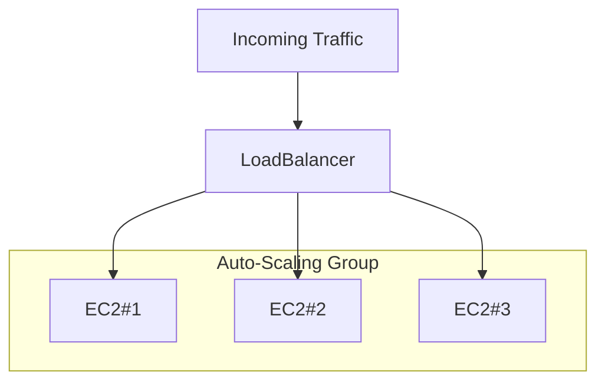

A load balancer acts as an entry point to your scalable resources; spreading the incoming traffic though your dynamic groups.

```mermaid
graph TD;
  incoming[Incoming Traffic]-->LoadBalancer
  LoadBalancer-->EC2#1
  LoadBalancer-->EC2#2
  LoadBalancer-->EC2#3
  subgraph output[Auto-Scaling Group]
  EC2#1
  EC2#2
  EC2#3
  end
```
