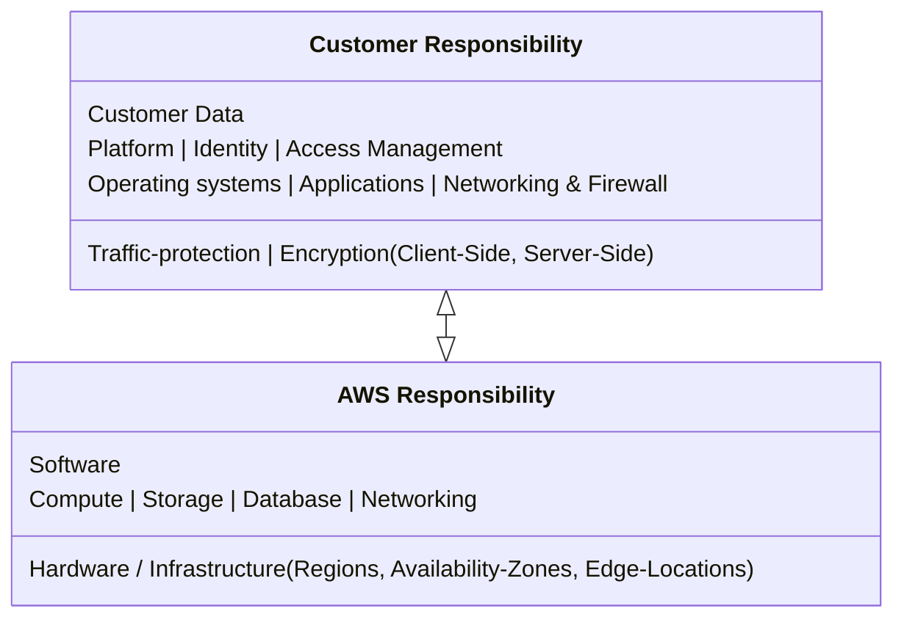

## Shared Responsibility Model ^responsibility-model

Responsibility in the cloud is shared between AWS & the customer. This is often compared to the responsibilities of a home owner vs a construction company.

## Root User ^root-user

When first creating an AWS account you begin with a root user; The root user can only be accessed w/ the email & password specified. The AWS root user is similar to a concept in Unix, it owns and has complete access to all resources.

It is considered best practice to only use the root user when needed and not as a general purpose account. (See: [[List of Services#^aws-iam|IAM]])
